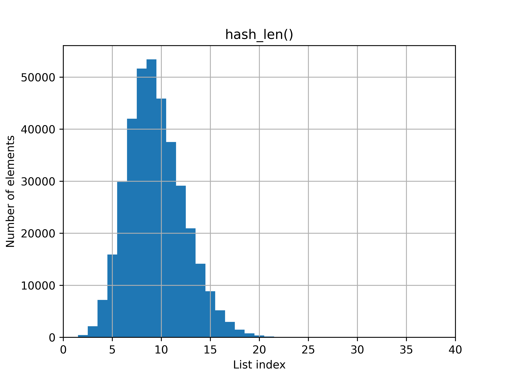
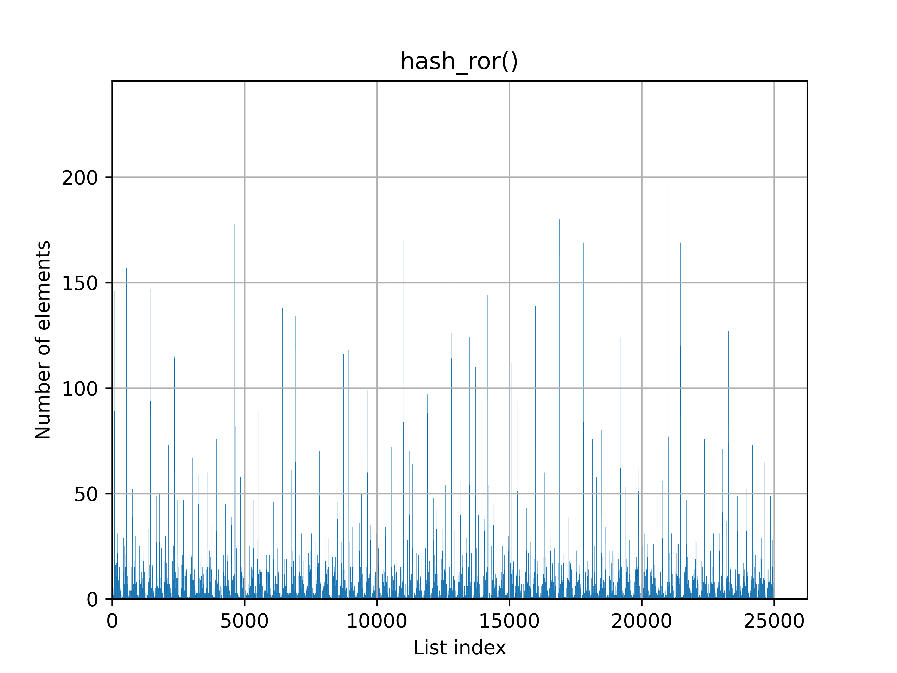
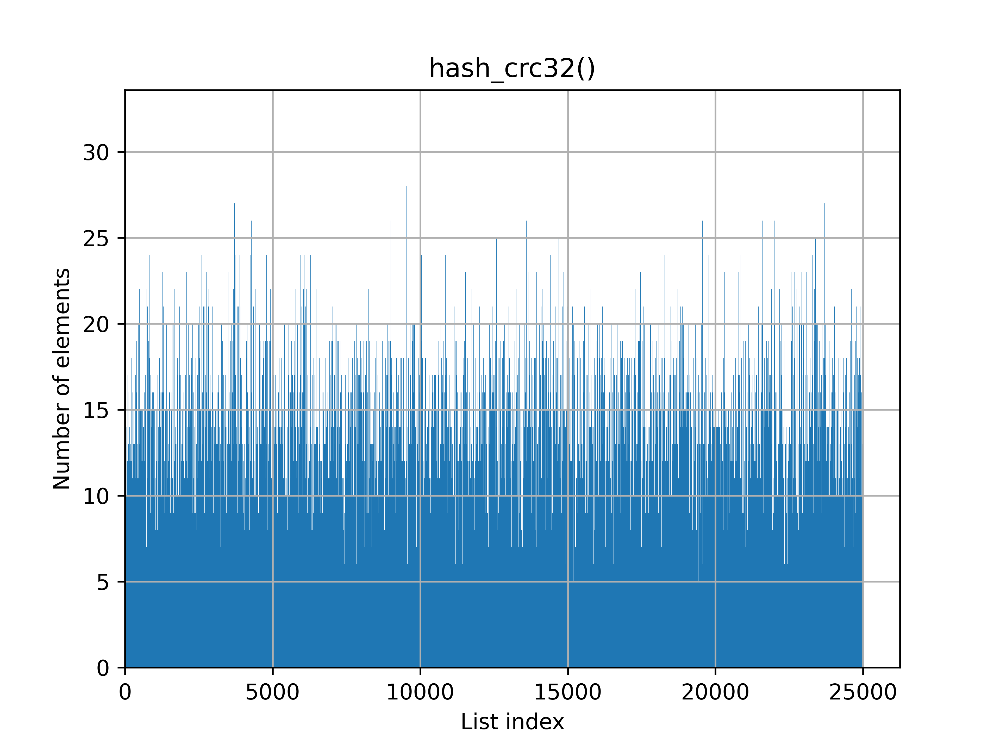
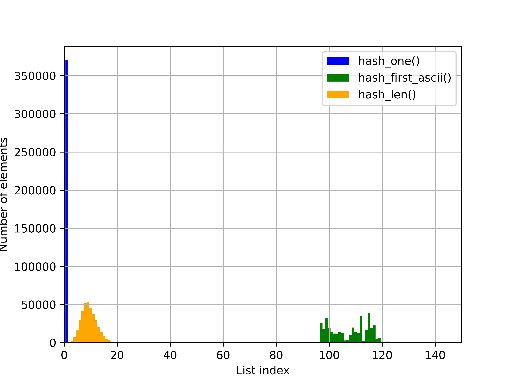
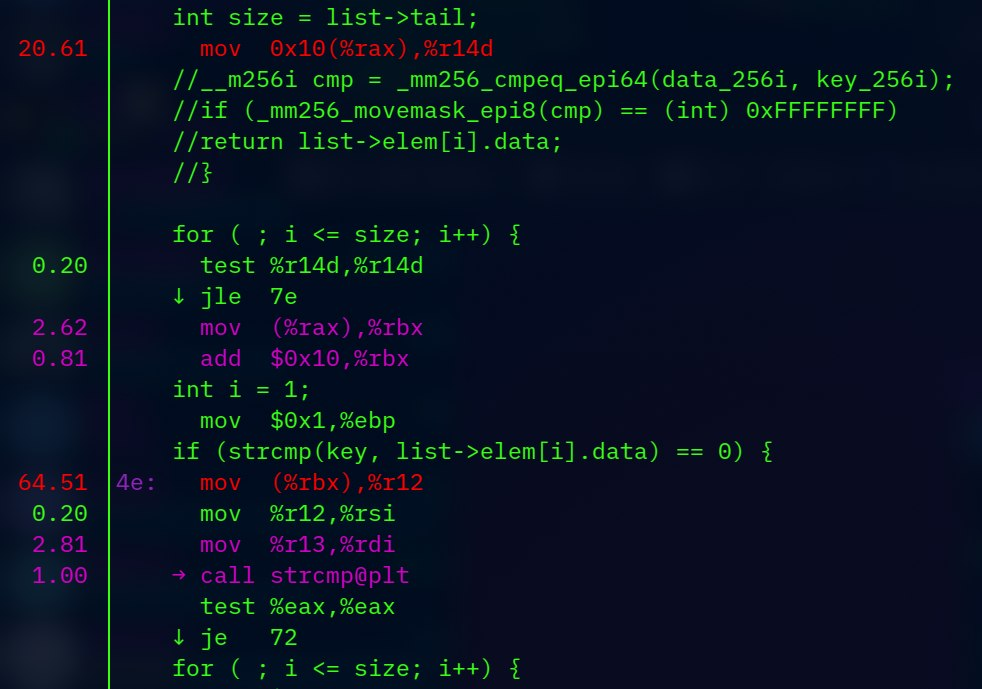
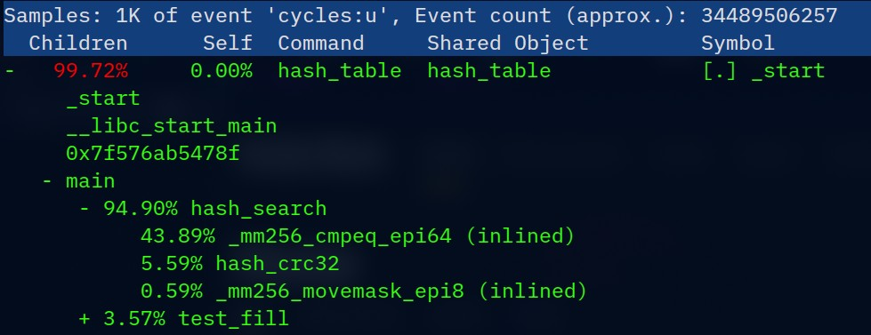

# hashtable

A little study on possible hashtable optimizations *(educational task)*.

## Table of contents
* [Introduction](#introduction)
* [Hash functions](#hash-functions)
* [Perfomance examination](#perfomance)
    * [First prototype](#first-prorotype)
    * [SIMD optimization](#simd-optimization)
    * [Assembly function](#assembly-function)
    * [GCC extended inline assembly](#inline-asm)
* [Conclusion](#conclusion)
* [Appendix](#appendix)

## Introduction

In this study we will examine possible optimizations of
[hashtables](https://en.wikipedia.org/wiki/Hash_table "Read more about hashtables") with chaining.
In this particular implementation hashtable is a structure with an array of 
[lists](https://github.com/princess-oregano/list "See list source code") and
function to calculate hash.

To fill hashtable with data, we will use [words_alpha.txt](words_alpha.txt)
(taken from [here](https://github.com/dwyl/english-words)).

If you want to recreate experiments, shown in this research, or to
use this hashtable implementation, then you will meet next prerequisites:
* `git`
* `make`
* `g++`
* `perf`
* CPU with AVX/AVX2 set of instructions

To examine program we will use next commands:

For tables and annotations:
```
perf record --call-graph dwarf -F 97 ./hash_table
perf report
```
For stats:
```
perf stat -r 10 ./hash_table 
```

All versions of program were compiled with both `-O2` and `-O1` flag for 
comparison. 

## Hash functions
In real-case hashtables average length of list is one element. To ensure, that 
hash function will give us even distribution, we will pick parameters so that average
length of lists will be appoximately 15 elements. We will examine 7 hash functions:
1. `hash_one()` always returns 1,
2. `hash_first_ascii` returns ASCII-code of the first character of key,
3. `hash_len` returns length of key,
4. `hash_sum_ascii` returns sum of key's characters' ASCII-codes,
5. `hash_rol` uses implementation of 
[ROL](https://www.aldeid.com/wiki/X86-assembly/Instructions/rol "Read more about ROL") instruction. 
It is calculated by next formulas: 
> H_0 = 0; 
>
> H_(i+1) = rol(H_i)^s[i];

where i = [0; strlen(key)],

6. `hash_ror` is similar to `hash_rol`, excepts it uses ROR instruction instead,
7. `hash_crc32` is typical CRC32 implementation.

The distribution (number of elements depending on list index)
is shown on next graphs (pay attention to scale on individual graphs: they are different, so
that the shape of chart was more distinctive):







    
And compound graphs:




As you can see, the CRC32 gives the best distribution. `hash_one()`, as expected,
gives the worst results. `hash_first_ascii()`, `hash_len()` and `hash_sum_ascii()`
are concentrated in one area, which is obviously bad as well. `hash_rol()` is the closest to even distribution
of CRC32, though still not good enough, and `hash_ror()` has sharp peaks on the whole
number line.

So, in the next part of this study we will use `hash_crc32` as the best option.

## Perfomance

In this section we will try to optimize `hash_search()` with different ways, such
as:
* inline assembly
* extern functions, written in assembly language
* [intrinsics](https://www.laruence.com/sse/ "Intel Intrinsic's Guide")

As this study is first and formost an educational task, usage of all methods is
mandatory, so some of them may seem a little... questionable. 

### First prototype

Our first prototype will be simple search function:
```c
char *
hash_search(hash_table_t *ht, const char *key)
{
        list_t *list = &ht->table[ht->hash(key) % TABLE_SIZE];
        int size = list->tail;

        for (int i = 1; i <= size; i++) {
                if (strcmp(key, list->elem[i].data) == 0) {
                        return list->elem[i].data;
                }
        }

        return nullptr;
}
```
Even by looking at this function, you can see a visible bottleneck: `strcmp()`. 

Indeed, when analizing program with `perf`, you can see the proof of that:


This version will be the default version of `hash_search()`. Useful information
for further comparison:


From this moment we will fill the next table: 

| Optimizations: | None
|---|---
| (-O2) Time of execution, s | 13.76 | 13.29 | 12.19 | 10.14
| (-O2) Prev_time / current_time | - | 1.035 | 1.091 | 1.202
| (-O2) Default_time / current_time | 1 | 1.035 | 1.129 | 1.357
| (-O1) Time of execution, s | 17.34 | 16.15 | 14.91 | 12.19
| (-O1) Prev_time / current_time | - | 1.074 | 1.083 | 1.223
| (-O1) Default_time / current_time | 1 | 1.074 | 1.163 | 1.422
| time_O1 / time_O2 | 1.260 | 1.215 | 1.223 | 1.202 |

### SIMD optimization

The first and most obvious thought is to use intrinsics, as we work with 
strings less than 32 bytes each, which is exactly the size of `__m256i`.
So, let's rework the fragment which uses `strcmp()`:
```c
__m256i key_256i = _mm256_load_si256((__m256i *) key);
__m256i data_256i = _mm256_load_si256((__m256i *) list->elem[i].data);

__m256i cmp = _mm256_cmpeq_epi8(data_256i, key_256i);
if (_mm256_movemask_epi8(cmp) == (int) 0xFFFFFFFF)
        break;
```
But then we start to see the next problem: key is not always formatted up to 32 bytes.
Actually, almost in all cases, it won't be. So, we need to come up with a way to 
format key to the size of 32 bytes. Again, let's start with the easiest choice:
```c
char format_key[32] = {0};
for (int i = 0; key[i] != 0; i++) {
        if (i == 31) {
                break;
        }
        format_key[i] = key[i];
}
```
The final version of hash_search() with these changes:
```c
char *
hash_search(hash_table_t *ht, const char *key)
{
        char format_key[32] = {};

        for (int i = 0; key[i] != 0; i++) {
                if (i == 31) {
                        break;
                }
                format_key[i] = key[i];
        }

        list_t *list = &ht->table[ht->hash(format_key) % TABLE_SIZE];
        int size = list->tail;

        for (int i = 1; i <= size; i++) {
                // AVX/AVX2 optimization of strcmp().
                const __m256i key_256i = _mm256_load_si256((const __m256i *) format_key);
                const __m256i data_256i = _mm256_load_si256((const __m256i *) list->elem[i].data);

                __m256i cmp = _mm256_cmpeq_epi64(data_256i, key_256i);
                if (_mm256_movemask_epi8(cmp) == (int) 0xFFFFFFFF)
                        return list->elem[i].data;
        }
        
        return nullptr;
}
```

The results are a little dissatisfying: we got accelaration by 3.5%.




| Optimizations: | None | + intrinsics
|---|---|---
| (-O2) Time of execution, s | 13.76 | 13.29 | 12.19 | 10.14
| (-O2) Prev_time / current_time | - | 1.035 | 1.091 | 1.202
| (-O2) Default_time / current_time | 1 | 1.035 | 1.129 | 1.357
| (-O1) Time of execution, s | 17.34 | 16.15 | 14.91 | 12.19
| (-O1) Prev_time / current_time | - | 1.074 | 1.083 | 1.223
| (-O1) Default_time / current_time | 1 | 1.074 | 1.163 | 1.422
| time_O1 / time_O2 | 1.260 | 1.215 | 1.223 | 1.202 |

It may seem, that default `strcmp()` function is only a bit slower, than intrinsic-based
implementation of the same function with fixed string length, which is, obviously, 
not true. The problem source is the part, where we format key to the size of 32 bytes. 
To prove that, we will leave that part of code, while using `strcmp()` again:


We can see a drastic time leap, which proves the theory.

> [NOTE] Why not use perf (annotate function) to prove the concept?
>
> The answer is bad precision of that measurements. On earlier stages, while analising 
`strcmp()`, you could see, that `mov` took almost 65%, while `strcmp()` call only about
1%. That is the same effect.

### Assembly function

So, the next visible bottleneck concerns formatting. To solve this program, writing 
a specific function in assembly language is a good option. 

```nasm
format:
        push rax
        push rcx

        mov rcx, 4

.loop:
        mov rax, qword [rsi]
        mov qword [rdi], rax

        add rdi, 4
        add rsi, 4

        loop .loop

.ret:
        pop rcx
        pop rax

        ret
```

Further analysis shows very good results:


| Optimizations: | None | + intrinsics | + asm function
|---|---|---|---
| (-O2) Time of execution, s | 13.76 | 13.29 | 12.19 | 10.14
| (-O2) Prev_time / current_time | - | 1.035 | 1.091 | 1.202
| (-O2) Default_time / current_time | 1 | 1.035 | 1.129 | 1.357
| (-O1) Time of execution, s | 17.34 | 16.15 | 14.91 | 12.19
| (-O1) Prev_time / current_time | - | 1.074 | 1.083 | 1.223
| (-O1) Default_time / current_time | 1 | 1.074 | 1.163 | 1.422
| time_O1 / time_O2 | 1.260 | 1.215 | 1.223 | 1.202 |

### Inline ASM

At this point, there is little to none possible options for optimizations:
most of the `hash_search()` is either intrinsics or asm. So we will step aside a little, and 
do something about hash functions.

There is a special intrinsic for that purposes (exactly CRC32), but according to task,
we must use inline asm:
```c
asm volatile (
        ".intel_syntax noprefix\n"
        "crc32 %0, %1\n"
        ".att_syntax prefix\n"
        : "=r" (crc)
        : "r" (*buf), "r" (crc)
        :
);
```

As we can see, it gives us serious boost:


## Conclusion

In total, we could optimize `hash_search()` function by **1.357** times, which is
a good result. All collected data is represented in the table below:

| Optimizations: | None | + intrinsics | + asm function | + inline asm(crc32) 
|---|---|---|---|---|
| (-O2) Time of execution, s | 13.76 | 13.29 | 12.19 | 10.14
| (-O2) Prev_time / current_time | - | 1.035 | 1.091 | 1.202
| (-O2) Default_time / current_time | 1 | 1.035 | 1.129 | 1.357
| (-O1) Time of execution, s | 17.34 | 16.15 | 14.91 | 12.19
| (-O1) Prev_time / current_time | - | 1.074 | 1.083 | 1.223
| (-O1) Default_time / current_time | 1 | 1.074 | 1.163 | 1.422
| time_O1 / time_O2 | 1.260 | 1.215 | 1.223 | 1.202 |

Also, it was proved, that CRC32 is better, than other hash functions out of
sample.

## Appendix

ded32 perfomance coefficient: 

$$ \eta = {optimization\ boost \over number\ of\ asm\ lines} \cdot 1000 = 1202.0,$$

or, if counting all lines in asm section

$$ \eta = 240.4.$$
